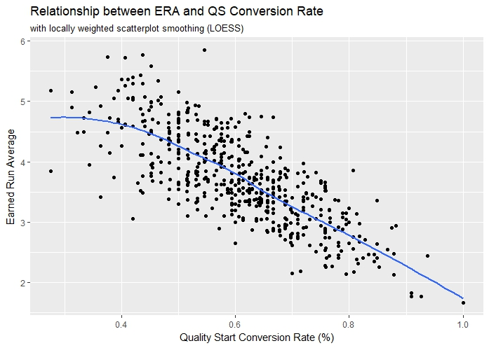
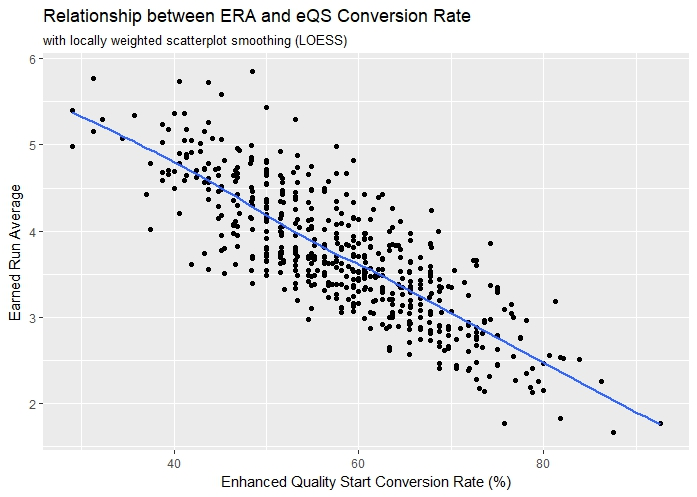
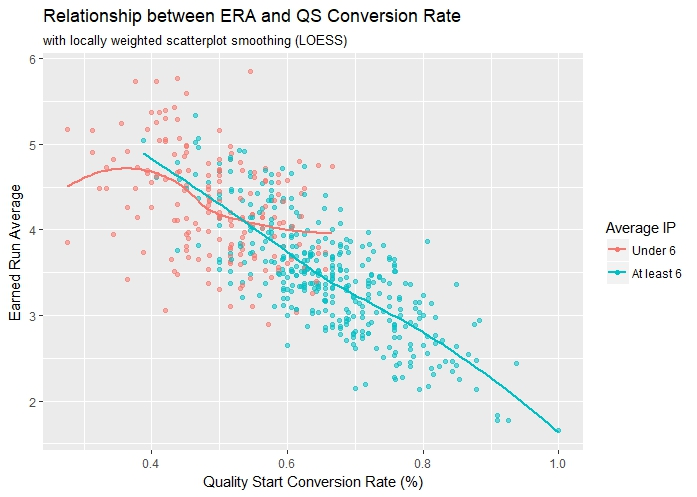
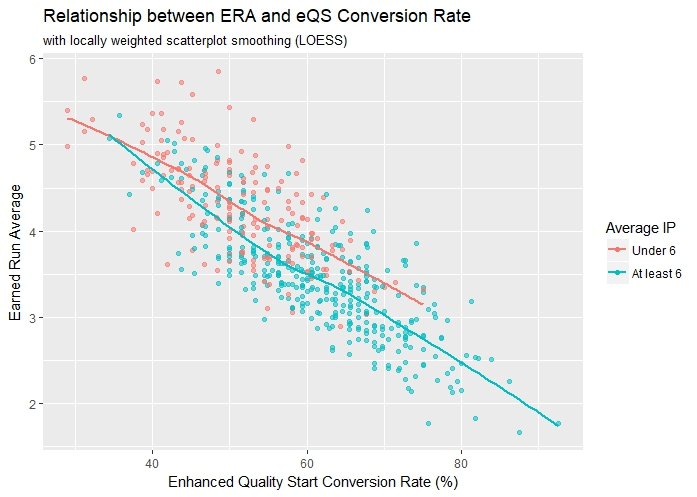

# Enhancing The Quality Start

## First Pitch

I'd like to start off by asking a trivia question:  

Who pitched better in 2015? Shelby Miller or Drew Hutchison?  

 

Here's a hint. Their records were 6-17 and 13-5, respectively.  

I'm guessing that with this information you would be comfortable answering Drew Hutchison.  

Here's another hint. Their ERAs were 3.02 and 5.57, respectively. Yes, respectively. Same order.

I'm guessing now you may be reconsidering.

Here's my point.  

The notion that wins are sufficient to measure starting pitcher performance would be absurd in today's game. First and foremost, it's a statistic that's heavily dependent on run support. Let's take a closer look at our Miller-Hutch example. Shelby Miller played with the Atlanta Braves and only tallied 6 wins in 33 starts because he only received 2.54 RS/9 (run support per 9 innings) from the league's *worst* offense. Meanwhile, Drew Hutchison played with the Toronto Blue Jays and tallied 13 wins in 28 starts behind 7.90 RS/9 from the league's *top* offense.  

In case you missed it, the answer to the trivia question was Shelby Miller. He was an All-Star in 2015.  

With the exception of pitchers like Madison Bumgarner or Shohei Ohtani, whose presence can be felt at the plate as well as the rubber, run support isn't something a pitcher can really control. So why do we put so much emphasis on wins? Clearly, wins are the currency of the game. Winning the World Series is what it's all about, but solely using wins to evaluate pitching *performance* is not the way to go. As you could see from the Miller-Hutch example, there are other statistics we can use to compare them. It's safe to say ERA is the "go-to" ratio statistic, but if you're hard-set on using a counting statistic, I'd suggest looking at the Quality Start. In our Miller-Hutch example, we'd find that Miller accumulated 21 QS (64% conversion rate) to Hutchison's 9 QS (32% conversion rate). Further evidence that Miller had the better 2015.  

Now... the Quality Start is far from a perfect statistic (it's not even a sortable option in Fangraphs). The criteria are simple: (1) pitch at least 6 innings and (2) allow no more than 3 earned runs. However, these simple criteria don't capture every *quality* performance, so just as the title of this article indicates, I decided to give the Quality Start an enhancement.

## Methodology

I've looked at many statistics that measure pitching performance, and I've noticed that very few incorporate run expectancy. One statistic that does is RE24 (Run Expectancy based on 24 base-out states) for both hitters and pitchers, but why not use run expectancy to create a new set of criteria for the Quality Start?

> Rather than award a pitcher a Quality Start for pitching at least 6 innings while allowing 3 earned runs or less, I propose a *quality* start should be awarded if the pitcher performs better than the league average, i.e. you should expect a lead at the end of the inning in which the starter leaves the game.

This can be determined with the following formula:

`PPS = (LARA * IP) - (RA + ERC)`

where PPS stands for "Pitching Performance Score", `LARA` is the league-average runs allowed per inning, `IP` is the innings pitched (rounding up if the starter can't finish an inning), `RA` is the runs the starter has allowed *the moment he leaves the game*, and `ERC` is the expected number of runs we charge the starter if he can't finish the inning. By definition, the PPS is the difference between the number of runs a league average pitcher would allow in the same number of innings and the *expected number of runs the starter allows*. Essentially, it's the number of runs you can expect to be leading by (or trailing by if PPS is negative) at the end of the inning in which the starter leaves the game. If PPS is positive, the starter is credited with an "enhanced" Quality Start (eQS). If PPS is negative, then he does not recieve credit.

I say "expected number of runs the starter allows" to address one of the issues with the current Quality Start statistic. Right now, it is entirely possible for a starter to be in line for a Quality Start and have that taken away from him **without ever throwing a pitch**. This can happen when he leaves the game with runners still on base. Whenever the starter leaves with runners on base, his pitching line is still in jeopardy. If the reliever allows the inherited runners to score, the starter gets charged. Thus, one of my enhancements is taking the bullpen completely out of the equation. Instead, whenever the starter leaves the game with runners still on base, he is charged for the number of runs we would expect to score in the remainder of the inning (`ERC`). This `ERC` can easily be found using a Runs Expectancy Matrix.

### Runs Expectancy Matrix

The Runs Expectancy Matrix was a critical component of my research, so I feel it's important that you become familiar with this concept before we move on.

A Runs Expectancy Matrix is a useful sabermetric tool that tells us the number of runs we would expect to be scored in the remainder of an inning for each of the 24 possible base-out states.

What's a base-out state?

A base-out state is a combination of the base occupancy and the number of outs at the beginning of each play. There are 8 different ways the bases can be occupied and there are 3 different out situations, so 8 x 3 = 24 base-out states. These 24 base-out states are the framework of the Runs Expectancy Matrix, as seen in the table below.

|          | **0 Out**  | **1 Out** | **2 Out**
:---------:|:----------:|:---------:|:----------:
 **- - -** |            |           |
 **- - 1** |            |           |
 **- 2 -** |            |           |
 **- 2 1** |            |           |
 **3 - -** |            |           |
 **3 - 1** |            |           |
 **3 2 -** |            |           |
 **3 2 1** |            |           |

Just to make sure you fully understand this concept, let's run through a quick example on how a Runs Expectancy Matrix is built. We'll run through a hypothetical half-inning and develop a corresponding Runs Expectancy Matrix.

Every inning starts the same way: "bases empty, 0 out", so we'll set up a counter in this state. The counter (denoted R) will keep track of every run scored for the remainder of the inning.

|          | **0 Out**  | **1 Out** | **2 Out**
:---------:|:----------:|:---------:|:----------:
 **- - -** |  **R = 0** |           |
 **- - 1** |            |           |
 **- 2 -** |            |           |
 **- 2 1** |            |           |
 **3 - -** |            |           |
 **3 - 1** |            |           |
 **3 2 -** |            |           |
 **3 2 1** |            |           |
 
Suppose the inning begins with a lead-off single. The base-out state changes to "man on 1st, 0 out", so we'll add a counter to this new state.

|          | **0 Out**  | **1 Out** | **2 Out**
:---------:|:----------:|:---------:|:----------:
 **- - -** |  R = 0     |           |
 **- - 1** |  **R = 0** |           |
 **- 2 -** |            |           |
 **- 2 1** |            |           |
 **3 - -** |            |           |
 **3 - 1** |            |           |
 **3 2 -** |            |           |
 **3 2 1** |            |           |
 
Similarly, if the next batter strikes out, we transition to the "man on 1st, 1 out" state and set up another counter.

|          | **0 Out**  | **1 Out** | **2 Out**
:---------:|:----------:|:---------:|:----------:
 **- - -** |  R = 0     |           |
 **- - 1** |  R = 0     |  **R = 0**|
 **- 2 -** |            |           |
 **- 2 1** |            |           |
 **3 - -** |            |           |
 **3 - 1** |            |           |
 **3 2 -** |            |           |
 **3 2 1** |            |           |

With a man on 1st and one out, the third batter blasts a 2-run homerun. The base-out state transitions to "bases empty, 1 out", but more importantly, 2 runs score in the process. Thus, for *each* of the previous counters we add 2 runs to the total. Note that we do not add 2 runs to the counter we just added.

|          | **0 Out**  | **1 Out** | **2 Out**
:---------:|:----------:|:---------:|:----------:
 **- - -** |  R = **2**     |  **R = 0**    |
 **- - 1** |  R = **2**     |  R = **2**    |
 **- 2 -** |            |           |
 **- 2 1** |            |           |
 **3 - -** |            |           |
 **3 - 1** |            |           |
 **3 2 -** |            |           |
 **3 2 1** |            |           |
 
Suppose the fourth batter hits another homerun. Back to back, baby! As a result, we stay in the "bases empty, 1 out" state and add another run. We set up a second counter in the same state and increment the other counters.

|          | **0 Out**  | **1 Out**     | **2 Out**
:---------:|:----------:|:-------------:|:----------:
 **- - -** |  R = **3**     |  R = **1**, **R = 0** |
 **- - 1** |  R = **3**     |  R = **3**        |
 **- 2 -** |            |               |
 **- 2 1** |            |               |
 **3 - -** |            |               |
 **3 - 1** |            |               |
 **3 2 -** |            |               |
 **3 2 1** |            |               |
 
Similarly, if the fifth batter hits a single, the base-out state transitions to "man on 1st, 1 out" and we add a second counter to that state.

|          | **0 Out**  | **1 Out**     | **2 Out**
:---------:|:----------:|:-------------:|:----------:
 **- - -** |  R = 3     |  R = 1, R = 0 |
 **- - 1** |  R = 3     |  R = 3, **R = 0** |
 **- 2 -** |            |               |
 **- 2 1** |            |               |
 **3 - -** |            |               |
 **3 - 1** |            |               |
 **3 2 -** |            |               |
 **3 2 1** |            |               |
 
No matter how complicated the inning may be, the procedure stays the same. After every play we add a counter to the respective base-out state (even if there is a counter already there) and increment all previous counters by the runs scored on the play. Each counter keeps track of the runs scored until the third out is made. Suppose the inning continues as follows:

ground-rule double,

|          | **0 Out**  | **1 Out**     | **2 Out**
:---------:|:----------:|:-------------:|:----------:
 **- - -** |  R = 3     |  R = 1, R = 0 |
 **- - 1** |  R = 3     |  R = 3, R = 0 |
 **- 2 -** |            |               |
 **- 2 1** |            |               |
 **3 - -** |            |               |
 **3 - 1** |            |               |
 **3 2 -** |            |  **R = 0**    |
 **3 2 1** |            |               |
 
sacrifice flyout, runner on 3rd scores,
 
|          | **0 Out**  | **1 Out**     | **2 Out**
:---------:|:----------:|:-------------:|:----------:
 **- - -** |  R = **4**     |  R = **2**, R = **1** |
 **- - 1** |  R = **4**     |  R = **4**, R = **1** |
 **- 2 -** |            |               |  **R = 0**
 **- 2 1** |            |               |
 **3 - -** |            |               |
 **3 - 1** |            |               |
 **3 2 -** |            |  R = **1**    |
 **3 2 1** |            |               |
 
and a strikeout to end the inning.

|          | **0 Out**  | **1 Out**     | **2 Out**
:---------:|:----------:|:-------------:|:----------:
 **- - -** |  R = 4     |  R = 2, R = 1 |
 **- - 1** |  R = 4     |  R = 4, R = 1 |
 **- 2 -** |            |               |  R = 0
 **- 2 1** |            |               |
 **3 - -** |            |               |
 **3 - 1** |            |               |
 **3 2 -** |            |  R = 1        |
 **3 2 1** |            |               |

With this data, we can build a rudimentary Runs Expectancy Matrix. The run expectancy for each state is simply the ratio of the total runs scored (T = sum of counters) and the number of times we reached that state (N = number of counters), T/N. 

|          | **0 Out**    | **1 Out**    | **2 Out**
:---------:|:------------:|:------------:|:------------:
 **- - -** | N = 1, T = 4 | N = 2, T = 3 |
 **- - 1** | N = 1, T = 4 | N = 2, T = 5 |
 **- 2 -** |              |              | N = 1, T = 0
 **- 2 1** |              |              |
 **3 - -** |              |              |
 **3 - 1** |              |              |
 **3 2 -** |              | N = 1, T = 1 |
 **3 2 1** |              |              |
 
In this particular example, we didn't have data for every state, so there will be a lot of blank spaces. This Runs Expectancy Matrix was built off of only 8 plays, so it isn't very meaningful. Over the course of an entire MLB regular season, there are over 100,000 plays that take place, more than enough to fill every possible base-out state with a meaningful run expectancy. 
 
|          | **0 Out**    | **1 Out**    | **2 Out**
:---------:|:------------:|:------------:|:------------:
 **- - -** |  4.000       |  1.500       |
 **- - 1** |  4.000       |  2.500       |
 **- 2 -** |              |              |  0.000
 **- 2 1** |              |              |
 **3 - -** |              |              |
 **3 - 1** |              |              |
 **3 2 -** |              |  1.000       |
 **3 2 1** |              |              |
 
Making interpretations from this example would be a terrible idea in real life, but we're going to do it here to explore the concept. Suppose someone who has never watched a game of baseball just happened to watch the top of the inning unfold. If they decided to stick around for the bottom of the inning, they would expect 4.000 runs to score since the inning starts off in the 'bases empty, 0 out' state. This is exactly what I'm doing to determine `LARA`. If the first batter strikes out and the person decides to leave, they would expect the home team to score 1.500 runs in the remainder of the inning since they are leaving with the game in the 'bases empty, 1 out' state. This is exactly what I'm doing to determine `ERC`.

Here's the Runs Expectancy Matrix based on the 2016 season.

|          | **0 Out**    | **1 Out**    | **2 Out**
:---------:|:------------:|:------------:|:------------:
 **- - -** |  0.498       |  0.268       |  0.106
 **- - 1** |  0.858       |  0.512       |  0.220
 **- 2 -** |  1.133       |  0.673       |  0.312
 **- 2 1** |  1.445       |  0.921       |  0.414
 **3 - -** |  1.347       |  0.937       |  0.372
 **3 - 1** |  1.723       |  1.196       |  0.478
 **3 2 -** |  1.929       |  1.358       |  0.548
 **3 2 1** |  2.106       |  1.537       |  0.695
 
Suppose a starter in 2016 pitches into the 7th inning before being pulled with 1 out, runners on 1st and 2nd, and having allowed 2 runs. Based on this Runs Expectancy Matrix, `LARA` is 0.498 runs per inning, so we would expect a league average pitcher to allow 3.486 runs in 7 full innings of work. `ERC` is 0.921 runs, so the starter is charged a total of 2.921 runs through 7 full innings. Since 3.486 - 2.921 = 0.565 > 0, the starter is credited with an eQS and a PPS of 0.565 for this game.

Using the formula for PPS and the above Runs Expectancy Matrix, we can even work backwards to determine the maximum number of runs a pitcher can allow and still be awarded an eQS. The table below shows this for every possible situation a pitcher can leave the game in through the first 9 innings. Note that a cell colored black represents a situation which is impossible to achieve an eQS.

### So, is eQS better?

If we make the assumption ERA is the gold standard for evaluating pitching performance, there is actually evidence the "enhanced" Quality Start is a better indicator of pitching performance than the Quality Start using the old criteria. A scatter plot of the ERA and QS Conversion Rates of 537 qualifying single-season pitching performances from 2011 to 2017 is shown below (using the old criteria to be clear). When we run the linear regression, we find it has an R-squared of 0.588. This tells us about 59% of the variation in ERA is explained by QS Conversion Rate.

Now take a look at the scatter plot of ERA and eQS Conversion Rate, the "enhanced" Quality Start Conversion Rate. Right away you'll notice it passes the eye test. Clearly, there is a stronger linear relationship between ERA and the conversion rate when run expectancy is incorporated. After running another linear regression, we find it has an R-squared of 0.670. This tells us 67% of the variation in ERA is explained by eQS Conversion Rate. That's an 8% increase!

Where exactly is this 8% coming from? Why does incorporating run expectancy give us an improvement? The answer lies in the fact there is no minimum inning requirement in this new metric. If we analyze the scatter plots even further, you'll notice that much of the improvement lies with the pitchers with lower conversion rates. These same pitchers tend to pitch less innings. Take a look at the first scatter plot again, but this time we'll distinguish those who averaged at least 6 innings per start. Although there is a good amount of overlap, it's easy to see much of the red lies to the left and much of the blue lies to the right.

Among those who averaged at least 6 innings per start (blue), there appears to be a strong linear relationship between ERA and conversion rate, which makes sense. For this group of pitchers, being awarded a QS *mainly* depends on how many earned runs they give up, which directly relates to performance. On the other hand, among those who averaged less than 6 innings per start (red), there is a weaker relationship between ERA and conversion rate, which also makes sense! For this group of pitchers, being awarded a QS not only depends on how many earned runs they give up, it also *commonly* depends on whether they reach the 6 inning minimum, which doesn't always relate to performance (e.g. pitch count, injury risk, pulled for pinch hitter, etc.).

By incorporating run expectancy, we put both groups of pitchers onto a level playing field. Take a look at the second scatter plot with both groups distinguished. Notice now that *both* groups have strong linear relationships between ERA and conversion rate. For pitchers who average at least 6 innings, the correlation between ERA and conversion rate increases from -0.766 to -0.806 (not a huge difference), but for pitchers who don't average 6 innings, the correlation increases from -0.395 to -0.674! Considering nearly a third (174/537) of single-season pitching performances fell into this latter group, incorporating run expectancy just makes sense.

I've only talked about ERA so far, but I also examined correlations with other pitching performance statistics such as Opponent Batting Average (AVG), WHIP, WAR, xFIP, WPA, RE24, K/9, and Winning Percentage (W%). In most cases, these statistics correlated better with the eQS Conversion Rate(bolded).

| Statistic | Correlation w/ QS Rate | Correlation w/ eQS Rate |
:----------:|:-----------------:|:-------------------:
**ERA** | **-0.767** | **-0.819**
**AVG** | **-0.572** | **-0.656**
**WHIP** | **-0.708** | **-0.731**
WAR | 0.676 | 0.663
xFIP | -0.549 | -0.477
**WPA** | **0.734** | **0.840**
**RE24** | **0.738** | **0.850**
**K/9** | **0.294** | **0.388**
**W%** | **0.532** | **0.591**

## Introducing APPS and FInn
 
I may have shown the "enhanced" Quality Start is a better indicator of pitching performance than its counterpart, but it still doesn't tell the whole story... and my journey didn't end there. I remember compiling the numbers right after the 2016 season (yeah, I've been working on this for a while) and finding JA Happ at the top of the leaderboard in eQS. I immediately told my friends about this and they're like, "you're stat is broken".

Yes and no.

I've found that eQS is a good metric to use when you're evaluating a pitcher's *consistency*. There's no doubt JA Happ was one of the most consistent pitchers of 2016. We just don't think of him as dominating. Unfortunately, eQS doesn't really capture the *dominance* of a pitcher, but we don't need to look far for a metric which does: PPS. eQS answers the "yes" or "no" question of whether a performance was better than league average; PPS tells us by how much. The most dominating pitchers will consistently have high PPS's. Thus, in order to capture this "dominance", I simply chose to look at the starter's average PPS over the course of the full season. In baseball terms, the Average Pitching Performance Score (APPS) is the average lead, or deficit, you can expect to have at the end of the inning of which the starter leaves the game.

You'll be glad to hear this paints a picture much closer to what's already in our heads. Clearly, there were pitchers in 2016 more dominant than JA Happ, and APPS would tell us there are many. Here is a list of the Top 20 Pitchers of 2016 in APPS (with at least 20 starts).

| Starting Pitcher |  GS  |  eQS  |  APPS
:-----------------:|:----:|:-----:|:------:
Clayton Kershaw    |  21  |  18   |  2.105
Kyle Hendricks     |  30  |  24   |  1.399
Jon Lester         |  32  |  24   |  1.356
Johnny Cueto       |  32  |  23   |  1.159
Max Scherzer       |  34  |  25   |  1.089
Noah Syndergaard   |  30  |  19   |  1.056
Justin Verlander   |  34  |  26   |  1.045
Junior Guerra      |  20  |  12   |  1.021
Jose Fernandez     |  29  |  19   |  1.005
Madison Bumgarner  |  34  |  24   |  0.964
Aaron Sanchez      |  30  |  23   |  0.931
Jake Arrieta       |  31  |  18   |  0.923
Tanner Roark       |  33  |  22   |  0.915
Jacob DeGrom       |  24  |  15   |  0.889
Masahiro Tanaka    |  31  |  21   |  0.867
Carlos Martinez    |  31  |  21   |  0.862
Jose Quintana      |  32  |  22   |  0.857
Chris Sale         |  32  |  24   |  0.826
**JA Happ**            |  **32**  |  **26**   |  **0.823**
Julio Teheran      |  30  |  19   |  0.823

If it didn't already jump out at you, Clayton Kershaw was a beast when he was on the mound. An APPS of 2.105 basically tells us that by the end of the inning Kershaw left the game, you could expect a 2.105 run lead. Ridiculous!

Yet, Kershaw's 2016 season didn't even crack the Top Ten in the all-time list, dating back to 1925. According to APPS, Pedro Martinez's 2000 season was the most dominant single-season performance in the history of baseball. Yeah, I don't think APPS is broken.

| Starting Pitcher | Year |  GS  |  eQS  |  APPS
:-----------------:|:----:|:----:|:-----:|:------:
Pedro Martinez     | 2000 |  29  |  26   | 2.767
Greg Maddux        | 1994 |  25  |  21   | 2.647
Greg Maddux        | 1995 |  28  |  25   | 2.642
Dwight Gooden      | 1985 |  35  |  30   | 2.341
Jim Turner         | 1937 |  28  |  22   | 2.282
Carl Hubbell       | 1936 |  26  |  21   | 2.217
Roger Clemens      | 1997 |  34  |  27   | 2.204
Lefty Grove        | 1931 |  30  |  25   | 2.194
Kevin Brown        | 1996 |  32  |  27   | 2.192
Hal Schumacher     | 1933 |  27  |  23   | 2.179

The fun doesn't end there! With APPS we quantified pitching performance *in terms of runs*. We also know the average runs that score per inning, so we can create a new metric that's *in terms of innings*!

I like to call it "Free Innings".

In baseball terms again, Free Innings (FInn) are the additional scoreless innings a starting pitcher gives, or costs, his team compared to the number of innings a league average starter would have to pitch to allow the same number of runs. This can be determined by simply dividing the starter's PPS by the correct `LARA`. For example, if a starter pitches a complete game shutout, he would earn 9 FInn. A league average pitcher would have to pitch 0 innings to give up 0 runs, so the starter went 9 innings longer than what a league average pitcher would have to pitch to give up 0 runs. You could also do the math; he would have a PPS of 9 times `LARA` for that game, and (9*`LARA`)/`LARA` is 9 FInn.

FInn is a bit more intriguing to me than APPS because Free Innings is a *counting statistic* that accumulates over the course of the season rather than a ratio statistic. It could easily be used as another way to measure a pitcher's value. It gets at the "quality" **as well as the "quantity"** behind a pitcher's performance. Here are the Top Ten Pitchers in Career FInn since 1925:

| Starting Pitcher | Seasons |  GS  |  eQS  |  FInn
:-----------------:|:-------:|:----:|:-----:|:------:
Roger Clemens      |  24     |  707 |  486  | 1242.0
Greg Maddux        |  23     |  740 |  494  | 1143.1
Tom Seaver         |  20     |  647 |  426  | 1099.2
Warren Spahn       |  21     |  633 |  419  | 1054.2
Jim Palmer         |  19     |  521 |  332  | 907.1
Pedro Martinez     |  18     |  409 |  291  | 897.0
Randy Johnson      |  22     |  603 |  407  | 835.2
Whitey Ford        |  16     |  437 |  294  | 822.0
Lefty Grove        |  17     |  396 |  268  | 793.1
Clayton Kershaw    |  10     |  290 |  227  | 792.0

Did you notice #10? Ridiculous!

## Summary

Clayton Kershaw is awesome.

The **"enhanced" Quality Start** tells us whether or not a starting pitcher pitched better than league average. This modified approach incorporates run expectancy and takes away the minimum inning requirement. As a result, this improves the correlation between ERA and "quality" start conversion rates, especially for starters that don't pitch deep into ballgames.

The **Average Pitching Performance Score** tells us the average lead, or deficit, you can expect to have at the end of the inning of which the starter leaves the game.

**Free Innings** are the additional scoreless innings a starting pitcher gives, or costs, his team compared to the number of innings a league average starter would have to pitch to allow the same number of runs.

All of my supporting R code can be found on my GitHub page: https://github.com/discmagnet/quality.start

test