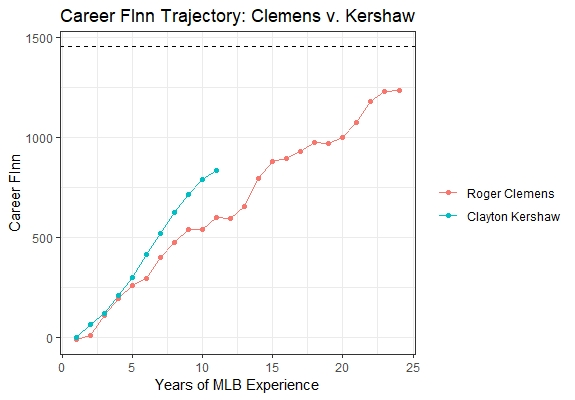

# Checking in with eQS: A 2018 Recap

## First Pitch

Back in July 2018, I wrote an article which introduced three new statistics that I developed to better evaluate starting pitching performance. All the important details can be found in the article (link), but here’s a quick summary of what all happened.

**The Enhanced Quality Start (eQS)**

The statistic that started this all. Unlike the old Quality Start where a pitcher needs to pitch at least six innings and allow no more than three earned runs, my new, “enhanced” Quality Start is awarded to a pitcher if he pitches *better than league average*. A wonderful statistic to look at if you want to see which pitchers are the most **consistent**.

**Average Pitching Performance Score (APPS)**

Building off of the Enhanced Quality Start, the Average Pitching Performance Score answers the question of *how much* better or worse than league average did the starter pitch. By definition, it tells us the average lead, or deficit, you can expect to have at the end of the inning of which the starter leaves the game. A wonderful statistic to look at if you want to see which pitchers are the most **dominant**.

**Free Innings (FInn)**

Building off of Average Pitching Performance Score, Free Innings also answers the question of how much better than league average the starter pitched, but this time it’s *in terms of innings*. By definition, it tells us the additional scoreless innings a starting pitcher gives, or costs, his team compared to the number of innings a league average starter would have to pitch to allow the same number of runs. A wonderful statistic to look at if you want to see which pitchers are the most **valuable**.

So before we completely say “Good-bye” to 2018 and “Hello” to 2019, let’s take a look at what these stats had to say about the results of last season.

## Cy Young Voters Got It Right

If you'd have asked me who my Cy Young award winners were at the end of Game 162, I would have chosen Jacob deGrom (duh) for the National League and Justin Verlander for the American League. Jacob deGrom was the runaway NL candidate with a sparkling 1.70 ERA over 217.0 innings while accumulating 269 strikeouts. He only had 10 wins on the season, but that was just a result of a lack of run support. The AL Cy Young wasn't quite as straightforward. Blake Snell may have led the league in Wins (21), ERA (1.89), and H/9 (5.6), but his only flaw was a lack of innings. He only pitched 180.2 innings in 31 starts. Justin Verlander, on the other hand, pitched 214.0 innings in 34 starts and led the league in strikeouts (290), WHIP (0.902), and K/BB (7.84). At some point, all of this becomes subjective. Both pitchers were incredible in 2018 in their own way.

The Cy Young Award is given to the best pitcher in each league. Defining who is *best* is difficult, but I believe the best pitcher is (1) the most consistent, (2) the most dominant, and (3) provides the most value to their team. Thankfully, I've got three of my own statistics I can use to make this decision for me. I would argue the most consistent pitcher will have the most Enhanced Quality Starts, the most dominant pitcher will have the highest Average Pitching Performance Score, and the most valuable pitcher will have the most Free Innings. Let's take a look at the 2018 leaders, starting with eQS.

**Top 13 Most Consistent Pitchers in 2018**

| Rank | Starting Pitcher |  GS  |  eQS  
:-----:|:----------------:|:----:|:-----:
   1   | Jacob deGrom     |  32  |  29
   2   | Aaron Nola       |  33  |  27
   .   | Max Scherzer     |  33  |  27
   .   | Blake Snell      |  31  |  27
   5   | Justin Verlander |  34  |  26
   6   | Gerrit Cole      |  32  |  24
   .   | Kyle Freeland    |  33  |  24
   8   | Jhoulys Chacin   |  35  |  23
   .   | Zack Greinke     |  33  |  23
   .   | Corey Kluber     |  33  |  23
   .   | Miles Mikolas    |  32  |  23
   .   | Chris Sale       |  27  |  23
   .   | Jameson Taillon  |  32  |  23

No surprise here. Jacob deGrom tops the list for the National League (and entire MLB) with 29 eQS (this means that deGrom pitched better than league average in 29 starts) in 32 starts. To my own surprise, we find that Blake Snell leads the American League with 27 eQS in 31 starts. Despite pitching in three more games, Verlander only had 26 eQS.

*Verdict:*

Most Consistent Pitcher in National League: Jacob deGrom

Most Consistent Pitcher in American League: Blake Snell

Okay, maybe it's not too much of a surprise that Snell was more consistent than Verlander, but I would think that Verlander was at least more dominant than Snell, right? Let's take a look at the 2018 leaderboard for APPS.

**Top Ten Most Dominant Pitchers in 2018**

| Rank | Starting Pitcher |  APPS  
:-----:|:----------------:|:------:
   1   | Jacob deGrom     |  1.878
   2   | Blake Snell      |  1.512
   3   | Aaron Nola       |  1.440
   4   | Chris Sale       |  1.435
   5   | Walker Buehler   |  1.334
   6   | Max Scherzer     |  1.318
   7   | Trevor Bauer     |  1.240
   8   | Justin Verlander |  1.229
   9   | Kyle Freeland    |  1.089
   10  | Gerrit Cole      |  1.026

For the National League, it would be trivial for me to point out #1, so I'd like to point out that Aaron Nola of the Phillies was the most dominant pitcher in the NL not named Jacob deGrom with an APPS of 1.440 (this means that you could expect a 1.440 run lead at the end of the inning he left the game). For the American League, not only was Blake Snell more dominant than Justin Verlander, he was more dominant than Chris Sale!

*Verdict:*

Most Dominant Pitcher in National League: Jacob deGrom

Most Dominant Pitcher in American League: Blake Snell

In my opinion, the Cy Young winner should be a workhorse who eats up innings to save a team's bullpen. So here is the real question. Was Blake Snell dominant enough to make up for the fact he pitched 33.1 fewer innings than Justin Verlander to provide more value. One could use WAR as evidence that Snell (7.5 WAR) was more valuable than Verlander (6.2 WAR), but we could also compare their Free Innings. Take a look at the Top Ten in FInn in 2018.

**Top Ten Most Valuable Pitchers in 2018**

| Rank | Starting Pitcher |  FInn  
:-----:|:----------------:|:------:
   1   | Jacob deGrom     |  121.2
   2   | Aaron Nola       |  96.1
   3   | Blake Snell      |  95.0
   4   | Max Scherzer     |  88.0
   5   | Justin Verlander |  84.2
   6   | Chris Sale       |  78.1
   7   | Kyle Freeland    |  72.2
   8   | Trevor Bauer     |  67.2
   9   | Gerrit Cole      |  66.1
   10  | Mike Clevinger   |  62.1

Once again, Jacob deGrom finds himself at the #1 spot on the list with 121.2 FInn (this means that deGrom gave the Mets an additional 121.2 scoreless innings compared to the number of innings a league average starter would have to pitch to allow the 48 runs he allowed). Notice that despite pitching 33.1 fewer innings, Blake Snell accumulated 10.1 more Free Innings than Justin Verlander.

*Verdict:*

Most Valuable Pitcher in National League: Jacob deGrom

Most Valuable Pitcher in American League: Blake Snell

**Conclusion**

Jacob deGrom was a beast.

If it didn't convince you, it at least convinced me. I'm a little bitter to admit it (my dad picked up Snell during the fantasy season and he won't let it go), but all three of my statistics indicate Snell was the best pitcher in the American League. I think the Cy Young voters got it right.

## The Continued Legacy of Clayton Kershaw

The man, the myth, the legend.

If it wasn’t already obvious in my first article, I kind of have a thing for Clayton Kershaw. Once baseball returns this spring, I'll be looking forward to three things: (1) watching my Milwaukee Brewers defend their NL Central division title, (2) watch my favorite hitter in Daniel Murphy rake at Coors Field, and (3) watch this man pitch. Seriously, he puts on a clinic every time he touches the rubber, and it's laughable just how foolish he can make some hitters look. If I had the opportunity to play catch with any major league player, I'd want to play catch with Clayton Kershaw.

At any rate, after introducing the concept of Free Innings in my first article, I provided a leaderboard of the Top Ten Pitchers of All-Time in Career FInn from 1925 to 2017. Through his first 10 seasons, Clayton Kershaw accumulated a remarkable 792.0 Free Innings and was already 10th on the all-time list. In 2018, Kershaw threw an additional 48.2 Free Innings. Here is the updated leaderboard through 2018.

| Starting Pitcher | Seasons |  GS   |  eQS  |  FInn
:-----------------:|:-------:|:-----:|:-----:|:------:
Roger Clemens      |  24     |  707  |  486  | 1242.0
Greg Maddux        |  23     |  740  |  494  | 1143.1
Tom Seaver         |  20     |  647  |  426  | 1099.2
Warren Spahn       |  21     |  633  |  419  | 1054.2
Jim Palmer         |  19     |  521  |  332  |  907.1
Pedro Martinez     |  18     |  409  |  291  |  897.0
**Clayton Kershaw**|**11**   |**316**|**246**|**840.2**
Randy Johnson      |  22     |  603  |  407  |  835.2
Whitey Ford        |  16     |  437  |  294  |  822.0
Lefty Grove        |  17     |  396  |  268  |  793.1

Kershaw is now #7 on the all-time list! In the process, he passed Hall-of-Famers Lefty Grove, Whitey Ford, and Randy Johnson. Six-time All-Star Lefty Grove (1925-1941) is one of 24 pitchers to ever accumulate 300 career Wins and was arguably the best pitcher of the Live-Ball Era. Ten-time All-Star Whitey Ford (1950-1967) was one of the best pitchers in the Integration Era. Then there's Randy Johnson (1988-2009) who was another ten-time All-Star and 300-game winner who was one of the best pitchers in the Steroid Era. That's some ridiculous company. If 2019 is another typical year for Kershaw, he'll pass two more Hall-of-Famers and move up to #5 on the all-time list.

Yeah, I'm ignoring the fact Kershaw failed to make the top ten in any of the above 2018 leaderboards, but who cares! What Kershaw has done the past 11 years is unprecedented. If he can keep up the pace he's been on, we are looking at a pitcher you could argue is the GOAT. Just take a look at how quickly Kershaw has accumulated his 840.2 Career FInn and compare it to the top man on the list, Roger Clemens. Kershaw has a chance to blow everyone out of the water.

I will continue to be a superfan of Clayton Kershaw. Not only do I want him to take over the #1 spot on the all-time list, I want him to reach a milestone that's found at the dashed line on the plot. This milestone is 1458 Free Innings. Yes, this is oddly specific, but there's something special about this number. 1458 is the total number of innings a team will play in 162 games (assuming 9 innings every game). If Kershaw reaches 1458 career Free Innings, you could say that he pitched **AN ENTIRE SEASON** of scoreless innings compared to the number of innings a league average starter would have to pitch to allow the same number of runs Kershaw did over the course of his career.